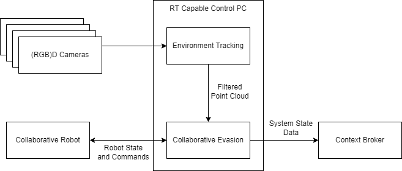

# DEC Component Documentation

The DEC Component is a low level (local) component that provides real time evasive capabilities to a robot manipulator. The DEC component is based on a real time control loop that runs an Artificial Potential Fields (APF) based algorithm to overlay a repulsive velocity on top of the current robot motions based on input from depth camera. The control loop also implements a mechanism to avoid running into singular or low manipulability configurations. 

Before being fed to the APF-based controller, the raw RGBD images are filtered to filter out the elements of the environment that are not to be evaded by the robot, i.e., the static elements of the environment and the robot itself and its manipulation targets.

## Description

| | Dynamic Efficient Collaboration |
|-|-|
| **Shorthand:**   | DEC |
| **Maintainer:**   | Ikerlan S. Coop. |
| **Application Area:**   | Improvement of collaboration efficiency  |
| **Main Functions:**   |  Tracks the presence of dynamic obstacles in the environment and adjusts dynamically the robot trajectory in order to avoid interference between human and robot tasks. Also provides semantic information on the state of the robot regarding the current collaboration state. |
| **Interfaces and Data-Input:** | Real time depth camera data (at least from one camera), real time robot joint position and velocity states and the robot's model (URDF) |
| **Functional Architecture Diagram:** |  |
| **Main Non-Functional Requirements/dependencies:** | The PC executing the DEC should be real-time capable, currently PREEMPT-RT patched Linux systems are supported. An OpenGL 4 compatible GPU is required. |
| **Hardware Requirements:** | At least one depth camera, a computer with a (wired) real time connection and control loop to the manipulator.  |
| **Security Threats:** | Run on a separate/segregated network (ROS security) without access to the public internet or to any network not authorized to use it.|
| **Privacy Threats:** | No specific privacy requirements. No personal information, camera or 3D data logging. |
| **Execution Place:** | Local. |
| **Privacy Threats:** | Internal development, deployment instructions only upon (approved) request. |
| **User Interface:** | Text configuration files and online configuration GUI |
| **Supported Devices:** | Any robot with ROS driver, URDF description and real time joint angles. Any Depth Camera with a ROS driver.
| **User defined scenarios (non-technical) and relevant pilot cases:** | Efficient human-robot collaboration. Use case: Household appliance disassembly (COOP) |
| **Roles/Actors:** | Collaborative Robots. |
| **Component Type:** | Native app. |
| **Development Environment:** | ROS 1, C++ source. |
| **TRL:** | Push from 3-4 to 5-6 |
| **Component Usability:** | Video from a WIP version showing similar functionality: [https://youtu.be/MqjKQv6fBsQ](https://youtu.be/MqjKQv6fBsQ) |
| **Versions:** | Single free version, option for paid support. |
| **Component Usability:** | Push from 3-4 to 5-6 |
| **Instructions Video:** | TBD |
| **Git:** | TBD |
| **RAMP:** | TBD |
| **Docker:** | N/A |

## Installation
Since the DEC component is given in the form of a docker image, the fastest way to download it is by pulling the image from the ramp site.

```
sudo docker pull <link:to_ramp_page>
```

Or in a manual way, you can also download the `dec.tar` file from [here](link). Then you have to load the image into docker by typing the following command:

```
docker load --input dec.tar
```


## Running
To run an example of a simulation of the DEC component please execute the following command:
```
sudo docker run -it --privileged --device=/dev/dri --group-add video --volume=/tmp/.X11-unix:/tmp/.X11-unix --env="DISPLAY=$DISPLAY" --network host dec
```

To launch the docker image on an iterative mode, please copy instead the following:
```
sudo docker run -it --privileged --device=/dev/dri --group-add video --volume=/tmp/.X11-unix:/tmp/.X11-unix --env="DISPLAY=$DISPLAY" --network host dec /bin/bash
```

### Warning disclaimer
The given examples of the docker image are prepared regarding to the specific use case and demonstrator developed during the COOP project. Therefore, this examples will run correctly on a laboratory setup with an identical distribution as the one found at IKERLAN's Digilab. For this reason, for any other scenario the image should be extended to adapt the environment of the robot to that specific use case.  

## Contact and maintainers
If additional support is required, please contact to:
* Diego Rodríguez: diego.rodriguez@ikerlan.es
* Ander González: ander.gonzalez@ikerlan.es

---

*Developed at IKERLAN S. Coop.*

